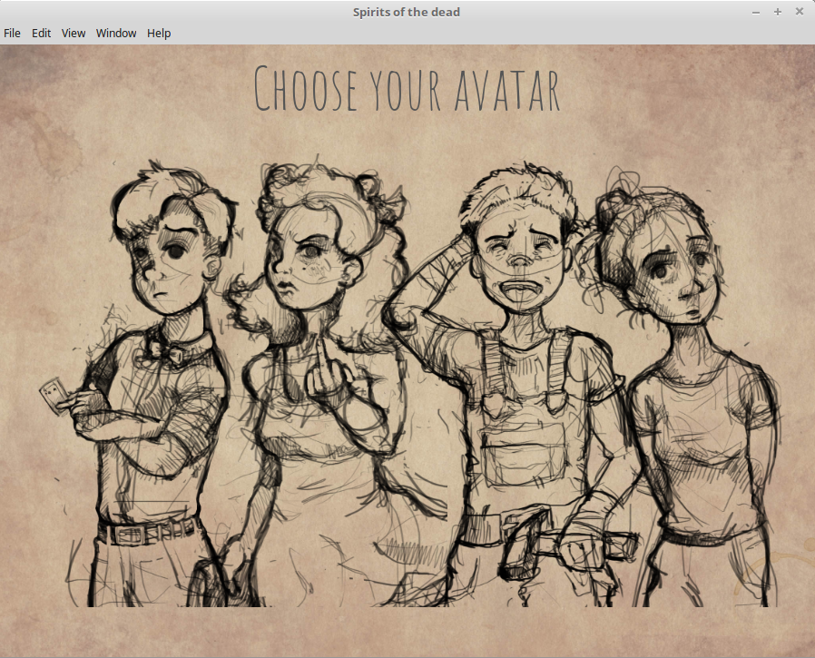

# Spirits of the Dead
...how it hangs upon the trees. A mystery of mysteries!


This is student project - multiplayer text based RPG.

## Project configuration
#### Install modules needed
```
npm install
```
#### Server configuration
* Compile server
```
npm run bsd
```
* Run the server (in 'bsd-server' directory)
```
./server
```
* Find the IP address of the machine that you have server on
```
ip a
```
#### Client configuration
* Change the IP address in resources/sockets.json to match the server address
* Run the client app
```
npm start
```

## Images



## Built with
* C++ 
* BSD sockets
* JavaScript 
* Node.js
* Electron
* Photoshop

## Authors
* [Piotr Ptak](https://github.com/pietersweter) - design/client
* [Łukasz Kobyłecki](https://github.com/lukaszkobylecki) - server/client

## License
This project is licensed under the MIT License.

## Contact
If you want to know more about the project, you can contact us, for example at:
* lukaszkobylecki@wp.pl
* lukkobylecki@gmail.com
* robakzdobywca@gmail.com
	